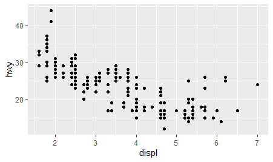
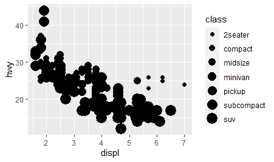
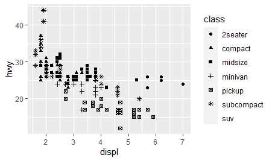
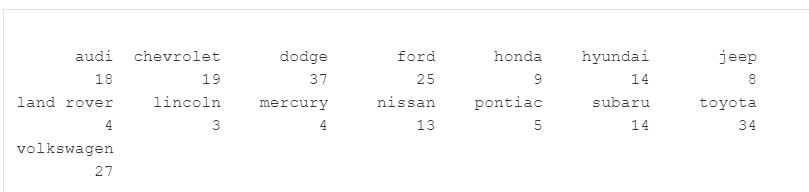
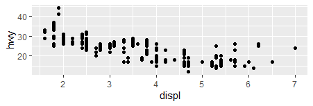
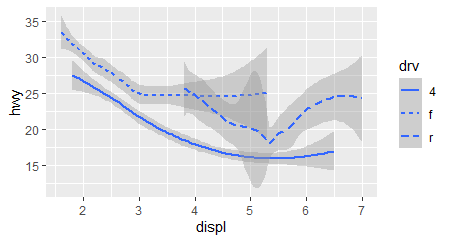
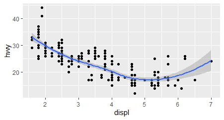
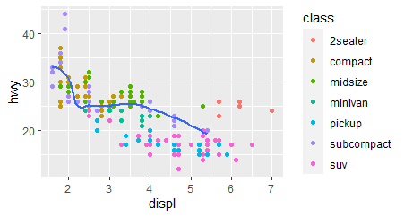
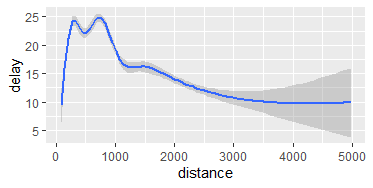

```{r setup, include=FALSE}
library(learnr)
library(gradethis)
tutorial_options(exercise.checker = gradethis::grade_learnr)
knitr::opts_chunk$set(echo = FALSE)
library(tidyverse)
library(nycflights13)
```
## Section 3.2.4 SD

### 3.2.4 Easy SD

 

After installing Tidyverse package, given the mpg dataset, plot a scatterplot between any two continuous variable. If you don't recall the variables you can type "?mpg" (without the quotation marks) or use colnames(mpg)


```{r two-plus-two, exercise=TRUE}

```

```{r two-plus-two-hint}
ggplot(data = ) + 
  geom_point(mapping = aes(x = , y = ))
```


### 3.2.4 Intermediate SD


Modify the following code so that the legends of the aesthetics is not shown:

```{r print-limit, exercise=TRUE, exercise.eval=TRUE}

x <- ggplot(data = mpg) + 
  geom_point(mapping = aes(x = displ, y = hwy, color = class))
print(x)
```

```{r print-limit-hint}
use the show.legend parameter of the geo_point() function.
```

```{r print-limit-solution}
x <- ggplot(data = mpg) + 
  geom_point(mapping = aes(x = displ, y = hwy, color = class),show.legend = FALSE)
print(x)
```

```{r print-limit-check}
gradethis::grade_this_code()
```


## Section 3.3.1 DN

### 3.3.1 Easy DN

#### Exercise 1 DN

Write the R code for putting mpg dataset into a mpg dataframe

```{r D1, exercise=TRUE}
mpg<- data.frame()
```

```{r D1-solution, include=FALSE}
mpg<- data.frame(mpg)
```

```{r D1-check}
gradethis::grade_this_code()
```

#### Exercise 2 DN

Write the R code for Viewing the mpg tibble
```{r D2, exercise=TRUE}

```
```{r D2-hint}
"use the View() function"
```

```{r D2-solution}
View(mpg)
```

```{r D2-check}
gradethis::grade_this_code()
```


## section 3.3.1 KA

### 3.3.1 Easy KA

Write the code that will load tidyverse:

```{r 22K, exercise=TRUE}

```
```{r 22K-hint-1}
"first part is library()"

```
```{r 22k-hint-2}
"you need to insert the word tidyverse"
```

```{r 22K-solution}
library(tidyverse)
```
```{r 22K-check}
gradethis::grade_code()
```

### 3.3.1 Easy KA

If you want to learn more about the mpg tibble what code could you run?

```{r two-plus-three, exercise=TRUE}

```
```{r two-plus-three-hint-1}
"use the ? sign"
```

```{r two-plus-three-solution}
?mpg
```

```{r two-plus-three-check}
gradethis:: grade_code()
```


## Section 3.3.1 SD

### 3.3.1 Easy SD


Edit the code by changing the color aesthetics to alpha aesthetics, mapping it to the class attribute:
**HINT**: *print x to view the graph*

```{r add-function, exercise=TRUE, exercise.lines = 5}
x <- ggplot(data = mpg) + geom_point(mapping = aes(x = displ, y = hwy, color = red)) 
print()
```

```{r add-function-hint}
 # alpha is a characteristic of the geometric element and determines the opacity.
```

```{r add-function-solution}
x <- ggplot(data = mpg) + geom_point(mapping = aes(x = displ, y = hwy, alpha = class)) 
print(x)
```

```{r add-function-check}
gradethis::grade_this_code()
```


###  3.3.1 Intermediate DN

#### Exercise 12 DN
Refer to the mpg data set.  

Plot a geom_point graph with displ on x-axis, hwy on y-axis, and map the shape of points to drv
```{r D12, exercise=TRUE}
ggplot(    ) + geom_point(    )
```

```{r D12-hint}
"Mapping the shape of points to drv means that the argument should be included inside aesthetic"
```

```{r D12-solution}
ggplot(data = mpg) + geom_point(mapping = aes(x = displ, y = hwy, shape= drv))
```

```{r D12-check}
gradethis::grade_this_code()
```


#### Exercise 13 DN

```{r D13}
quiz(
  question("Which of the following are considered asethetics in geom_point ?",
    answer("fill", correct = TRUE),
    answer("shape", correct = TRUE),
    answer("size", correct= TRUE),
    answer("length")
  )
)
```

### 3.3.1 Intermediate KA

<!--  -->


enter the code that creates the above graph

```{r two-plus-four, exercise=TRUE}

```

```{r two-plus-four-hint-1}
"you need to use both ggplot() and ggplot_point()"
```

```{r two-plus-four-hint-2}
"ggplot(data = mpg) + 
  geom_point(mapping = aes(x= , y= ))"
```

```{r two-plus-four-solution}
ggplot(data = mpg) + 
  geom_point(mapping = aes(x = displ, y = hwy))
```

```{r two-plus-four-check}
gradethis:: grade_code()
```

### 3.3.1 Intermediate KA

<!--  -->


Although using size for a discrete variable is not advised, nevertheless, complete the code to create the above graph

```{r two-plus-five, exercise=TRUE}

ggplot(data = mpg) + 
  geom_point(mapping = aes(x = displ, y = hwy, ))
             
```

```{r two-plus-five-hint-1}
"missing part is size"
```

```{r two-plus-five-solution}
ggplot(data = mpg) + 
  geom_point(mapping = aes(x = displ, y = hwy, size = class))
```
```{r two-plus-five-check}
gradethis:: grade_code()
```

### 3.3.1 Intermediate SD


Question to verify that one has understood the basics of ggplot:

```{r quiz7}
quiz(
  question("Which of the following modifies a ggplot or theme object by adding on new components?",
    answer("+",correct = TRUE),
    answer("*"),
    answer("/"),
    answer(".")
  )
)
```


```{r quiz8}
quiz(
  question("What are the basic units in the grammar of graphics?",
    answer("Data and layers"),
    answer("Geometries and data"),
    answer("The data, the aesthetics, and the geometries", correct = TRUE),
    answer("Aesthetics and geometries")
  )
)
```


### 3.3.1 Advanced DN  

#### Exercise 23 DN

Divide mpg dataframe into 2 halves and plot 2 separate geom_point graphs  with displ on x-axis and hwy on y-axis  respectively.
**Note**:"spliting the mpg dataframe requires floor(), set.seed(), sample(), seq(). You many want to get help on this functions first". Also, note we are getting a random sample for each of the 2 halves.

```{r D23, exercise=TRUE}
half_size <- floor(0.5*  )
set.seed(123123)
mpg_half <- sample(seq(   ), size= half_size)

mpg_1 <- mpg[mpg_half, ]
mpg_2 <- mpg[-mpg_half, ]

ggplot(data= mpg_1) +
  geom_point(  )
ggplot(data=mpg_2) +
  geom_point(  )
```

```{r D23-solution}
half_size <- floor(0.5*nrow(mpg))
set.seed(123123)
mpg_half <- sample(seq(nrow(mpg)),size= half_size)

mpg_1 <- mpg[mpg_half, ]
mpg_2 <- mpg[-mpg_half, ]

ggplot(data= mpg_1) +
  geom_point(mapping = aes(x= displ, y = hwy))
ggplot(data=mpg_2) +
  geom_point(mapping = aes(x= displ, y = hwy))
```

```{r D23-check}
gradethis::grade_this_code()
```

### 3.3.1 Challenging KA

<!--  -->


run the code that creates the graphs above

```{r two-plus-six, exercise=TRUE}

```
```{r two-plus-six-hint-1}
"you need to add shape = class"
```
```{r two-plus-six-solution}
ggplot(data = mpg) + 
  geom_point(mapping = aes(x = displ, y = hwy, shape = class))
```
```{r two-plus-six-check}
gradethis:: grade_code()
```

### 3.3.1 Challenging  SD

Make a 3D scatterplot to analyse the relation between sepal length, sepal width and petal length.
```{r Challenge, exercise=TRUE,exercise.eval = TRUE}
#install.packages("plot3D")
library(plot3D);library(tidyverse)
```

```{r Challenge-hint}
#Step1 run data("iris") & head(iris)
#Step2 Define x,y, and z coordinates. For example, x<-iris$Sepal.Length
#Step3 use scatter3D(x,y,z,clab = c("Sepal","Width(cm)"))
#See this link for more info: https://preludeinr.com/graphs-and-plots/fancy-a-little-bit-of-3d/
```
## Section 3.5.1 SD

### 3.5.1 Easy SD


Let's try making facets for our mpg data and displ as x and hwy as y. Use facet_wrap() on any one categorical variable & facet_grid() on any two categorical variables. Can you see the difference?
```{r Facet, exercise=TRUE}
ggplot(data=)+geom_point()+
  
ggplot(data=)+geom_point()+  
  
```

```{r Facet-hint-1}
"the first argument of facet_wrap() is a tilda followed by the categorical variable "
"remember a tilda looks like this: ~"
```
```{r Facet-hint-2}
"the argument of facet_grid() has two variables separated by a tilda "
```

```{r Facet-solution}
ggplot(data = mpg) + 
  geom_point(mapping = aes(x = displ, y = hwy)) + 
  facet_wrap(~ class, nrow = 2)
  
ggplot(data = mpg) + 
  geom_point(mapping = aes(x = displ, y = hwy)) + 
  facet_grid(drv ~ cyl)
```


### 3.5.1 Intermediate SD

*Where do we use geom_smooth? A linear model can be created on a scatterplot by using this technique which will deliver the 'best fit' line or a line average of all the points.*

For the airquality dataset, given the scatterplot, find the 'best fit' line:

```{r airquality, exercise=TRUE, exercise.eval=TRUE}
library(tidyverse)

ggplot(data = airquality,aes(y=Wind,x=Temp))+geom_point()
```

```{r airquality-hint}
geom_point()+geom_smooth()
```
```{r airquality-solution}
ggplot(data = airquality,aes(y=Wind,x=Temp))+geom_point()+geom_smooth()
```

```{r airquality-check}
gradethis::grade_this_code()
```

<!-- ### 3.5.1 Challenging  SD -->

<!-- Let's do some visualization with the basic knowledge. We are working with the mpg dataset. Questions will be in steps: -->

<!-- Step 1: Find the number of rows and columns of the dataset. -->

<!-- Step 2: Find the table of manufacturers. You want to show each how many instances (rows) in our dataset are there for each possible manufacturer. It would look something like this: -->

<!-- <!--  --> -->
<!--  -->


<!-- Step 3: Make a bar chart to represent the number of manufacturers. -->

<!-- ```{r Step1, exercise=TRUE, exercise.eval=TRUE} -->

<!-- ``` -->

<!-- ```{r Step1-hint1} -->
<!-- # Use table() and then index the attribute you want to show ($) -->
<!-- ``` -->

<!-- ```{r Step1-hint2} -->
<!-- # geom can take point, smooth, bar etc. -->
<!-- ``` -->

<!-- ```{r Step1-solution} -->
<!-- nrow(mpg) -->
<!-- ncol(mpg) -->
<!-- table(mpg$manufacturer) -->
<!-- qplot(manufacturer, data=mpg, geom="bar", fill=manufacturer) -->
<!-- ``` -->

<!-- # ```{r step1-check} -->
<!-- # gradethis::grade_this_code() -->
<!-- # ``` -->


########################################
## Section 3.6.1 DN

### 3.6.1 Easy DN

#### Exercise 3 DN

```{r D3}
quiz(
  question("Which of the following are considered variables in facet_wrap ?",
    answer("rows"),
    answer("cols"),
    answer("nrow", correct= TRUE),
    answer("ncol", correct= TRUE)
  )
)
```

#### Exercise 4 DN

```{r D4}
quiz(
  question("Which of the following are considered variables in facet_grid ?",
    answer("rows", correct= TRUE),
    answer("cols", correct= TRUE),
    answer("nrow"),
    answer("ncol")
  )
)
```

### Easy 3.6.1 KA
```{r quiz1a}
question("which is geom?",
  answer("A geom is the geometrical object that a plot uses to represent data", correct = TRUE),
  answer("is a german car"),
  answer("is a programing language")
)
```

### 3.6.1 Easy KA
<!--  -->


run the code to create the above graph using ggplot()


```{r two-plus-eight, exercise=TRUE}

```

```{r two-plus-eight-solution}
ggplot(data = mpg) + 
  geom_point(mapping = aes(x = displ, y = hwy))
```

```{r two-plus-eight-check}
gradethis:: grade_code()
```


## Section 3.6.1 YY


#### 3.6.1 Easy YY
Change the number of nrow in the code below and run the code to understand what nrow means.
```{r 136, exercise=TRUE, exercise.eval=TRUE}
ggplot(data = mpg) + 
  geom_point(mapping = aes(x = displ, y = hwy)) + 
  facet_wrap(~ class, nrow = 2)
```
```{r 136-hint-1}
"nrow means numbr of the row "
```

#### Exercise 2  

```{r quiz236}
question("Which of the geom that is for displaying the results with a non-standard geom",
  answer("geom_smooth", correct = TRUE),
  answer("geom_point"),
  answer("geom_bar"),
  answer("There is no answer here.")
)
```
## Section 3.6.1 SD

### 3.6.1 Easy SD

*Labeling is important for both the analyst and for those who use those visualizations*

Let's label the facets we made by putting lab() function
```{r Labeling, exercise=TRUE}

```

```{r Labeling-hint}
# Use labs()
```

```{r Labeling-solution}
ggplot(data = mpg) + 
  geom_point(mapping = aes(x = displ, y = hwy)) + 
  facet_wrap(~ class, nrow = 2)
labs(
  title = "Facet wrap",
)
```

```{r Labeling-check}
gradethis::grade_this_code()
```


### 3.6.1 Intermediate DN

#### Exercise 14 DN

Recreate the R code necessary to generate the following graphs
```{r D14-graph}
ggplot(data=mpg, mapping = aes(x= displ, y= hwy)) +
  geom_point() +
  geom_line()
```

```{r D14, exercise=TRUE}
ggplot(data=mpg, mapping = aes(   ,   )) +
  geom_point() +
  geom_line()
```

```{r D14-hint}
"You would need 2 geom graphs"
```

```{r D14-solution}
ggplot(data=mpg, mapping = aes(x= displ, y= hwy)) +
  geom_point() +
  geom_line()
```

```{r D14-check}
gradethis::grade_this_code()
```

#### Exercise 15 DN

Recreate the R code necessary to generate the following graphs
```{r D15-graph}
ggplot() +
  geom_point(data=mpg, mapping= aes(x=displ, y= hwy, color= drv)) +
  geom_line(data=mpg, mapping = aes(x=displ, y= hwy, color= drv))

```

```{r D15, exercise=TRUE}
ggplot() +
  geom_point() +
  geom_line()

```

```{r D15-hint}
"You should map the color of points to drv variable"
```

```{r D15-solution}
ggplot() +
  geom_point(data=mpg, mapping= aes(x=displ, y= hwy, color= drv)) +
  geom_line(data=mpg, mapping = aes(x=displ, y= hwy, color= drv))
```

```{r D15-check}
gradethis::grade_this_code()
```  

### 3.6.1 Intermediate KA

<!--  -->


fix the code to create the graph above

```{r two-plus-nine, exercise=TRUE}
ggplot(data = mpg) + 
  geom_point(mapping = aes(x = displ, y = hwy, linetype = drv))
```
```{r two-plus-nine-hint-1}
"try geom _smooth() rather than geom_point()"
```

```{r two-plus-nine-solution}
ggplot(data = mpg) + 
  geom_smooth(mapping = aes(x = displ, y = hwy, linetype = drv))
```

```{r two-plus-nine-check}
gradethis:: grade_code()

```

### 3.6.1 Intermediate KA

<!--  -->


create the above graph

```{r two-plus-ten, exercise=TRUE}

```

```{r two-plus-ten-hint-1}
"ggplot(data = mpg, mapping = aes(x = displ, y = hwy)) + "
```

```{r two-plus-ten-solution}
ggplot(data = mpg, mapping = aes(x = displ, y = hwy)) + 
  geom_point() + 
  geom_smooth()
```

```{r two-plus-ten-check}
gradethis::grade_code()

```

### 3.6.1 Intermediate YY
#### Exercise 3

Change the variable that is assigned to linetype to "cyl" and predict what will be created before run the code.
```{r 336, exercise=TRUE, exercise.eval=TRUE}
ggplot(data = mpg) + 
  geom_smooth(mapping = aes(x = displ, y = hwy, linetype = drv))
```
```{r 336-hint-1}
"Be careful!! "
```
```{r 336-solution}
ggplot(data = mpg) + 
  geom_smooth(mapping = aes(x = displ, y = hwy, linetype = cyl))
```
```{r 336-check}
gradethis::grade_code()
```
#### Exercise 4
Add codes and  make it run.

```{r 436, exercise=TRUE, exercise.eval=TRUE}
ggplot() + 
  geom_smooth()
```
```{r 436-hint-1}
"Function that couse error is what we read in chapter 3.5.
Remember what you learned. "
```
```{r 436-solution}
ggplot(data = mpg, mapping = aes(x = displ, y = hwy)) + 
  geom_smooth()
```
```{r 436-check}
gradethis::grade_code()
```


### Advanced 3.6.1 DN

#### Exercise 24 DN

Refer to the mpg dataset.  

Write the R code to plot 1 geom_point graph and 1 geom_smooth graph, with color=class, excluding all 2seater cars  

```{r D24, exercise=TRUE}
ggplot(data = mpg, mapping = aes(x = displ, y = hwy)) + 
   geom_point(data =   ) + 
   geom_smooth(data = , se=FALSE)
```

```{r D24-hint}
"Remind yourself how you utilized filter() function earlier "
```

```{r D24-solution}
ggplot(data = mpg, mapping = aes(x = displ, y = hwy)) + 
   geom_point(data = filter(mpg, class != "2seater"), mapping = aes(color = class)) + 
   geom_smooth(data = filter(mpg, class != "2seater"), se= FALSE)
```

```{r D24-check}
gradethis::grade_this_code()
```

### 3.6.1 Challenging KA

<!--  -->


finish the code to create the above graph

```{r two-plus-zero, exercise=TRUE}
ggplot(data = mpg, mapping = aes(x = displ, y = hwy)) + 
  geom_point(mapping = aes(color = class)) + 
  geom_smooth(
```

```{r two-plus-zero-hint-1}
"you have to use the filter()"

```

```{r two-plus-zero-solution}
ggplot(data = mpg, mapping = aes(x = displ, y = hwy)) + geom_point(mapping = aes(color = class)) + geom_smooth(data = filter(mpg, class =="subcompact"), se = FALSE)  
```

```{r two-plus-zero-check}
gradethis:: grade_code()

```

### 3.6.1 Challenging  YY
#### Exercise 5

Create the graphs below.


```{r 536, exercise=TRUE, exercise.eval=TRUE}

```
```{r 536-hint-1}
"use geom_points"
```
```{r 536-solution}
ggplot(data = mpg) + 
  geom_point(mapping = aes(x = displ, y = hwy)) +
  geom_smooth(mapping = aes(x = displ, y = hwy))
```
```{r 536-check}
gradethis::grade_code()
```

####################################################################


## Section 3.7.1 YY

### 3.7.1 Easy YY
#### Exercise 1

In this execise we are going to use new dataset called diamonds.
Run the code to get to know diamonds.
```{r 137, exercise=TRUE, exercise.eval=TRUE}

```
```{r 137-hint-1}
"Use ? "
```
```{r 137-solution}
?diamonds
```
```{r 137-check}
gradethis::grade_code()
```

#### Exercise 2  

```{r quiz37}
question("According to the text, which kind of graph compute a robust summary of the distribution and then display a specially formatted box?",
  answer("boxplots", correct = TRUE),
  answer("bar graph"),
  answer("scatter plot"),
  answer("spider chart")
)
```
### 3.6.1 Intermediate SD

#### BLANK

### 3.6.1 Challenging  SD

#### BLANK

####################################################################


## Section 3.7.1 SD

### 3.7.1 Easy SD

```{r quiz1}
question("Which of the geom that is for displaying the results with a non-standard geom",
  answer("geom_smooth", correct = TRUE),
  answer("geom_point"),
  answer("geom_bar"),
  answer("There is no answer here.")
)
```
```{r quiz1-check}
gradethis::grade_this_code()
```


```{r quiz2}
quiz(
  question(" ________ function is similar to the existing subset() function in R but is quite a bit faster.",
    answer("rename"),
    answer("set"),
    answer("filter", correct = TRUE),
    answer("subset")
  )
)
```
```{r quiz2-check}
gradethis::grade_this_code()
```


```{r quiz3}
quiz(
  question(" Columns can be arranged in descending order too by using the special ____ operator.",
    answer("asc()"),
    answer("desc()", correct = TRUE),
    answer("descending()"),
    answer("subset")
  )
)
```
```{r quiz3-check}
gradethis::grade_this_code()
```
*we will be using the nycflights database in these exercises*

```{r quiz4}
quiz(
  question(" The ______ operator allows you to string operations in a left-to-right fashion.",
    answer("This %<%"),
    answer("This %%%"),
    answer("This %>%", correct = TRUE),
    answer("This >%>%")
  )
)
```

```{r quiz4-check}
gradethis::grade_this_code()
```

```{r quiz5}
quiz(
  question(" Which of the following return a subset of the columns of a data frame?",
    answer("get"),
    answer("select", correct = TRUE),
    answer("set"),
    answer("retrieve")
  )
)
```

```{r quiz5-check}
gradethis::grade_this_code()
```


### 3.7.1 Intermediate YY
#### Exercise 3


Run the code below. That code have "stat_count" and you can see the graph. Change variable of x-axis to "color".
```{r 337, exercise=TRUE, exercise.eval=TRUE}
ggplot(data = diamonds) + 
  stat_count(mapping = aes(x = cut))
```
```{r 337-solution}
ggplot(data = diamonds) + 
  stat_count(mapping = aes(x = color))
```
```{r 337-check}
gradethis::grade_code()
```

#### Exercise 4
```{r quiz437}
question("what does prep in the code mean? ",
  answer("variable prep"),
  answer("count of each variable"),
  answer("what percentage does each varlable occupy.", correct = TRUE),
  answer("No answer here")
)
```
### 3.7.1 Challenging  YY
#### Exercise 5

Create the graphs below.(Top and bottom of each line and each point means max value, minimum value and median respectively.)


```{r 537, exercise=TRUE, exercise.eval=TRUE}

```
```{r 537-hint-1}
"the points on the lines are median. Thus, use fun = median"
```
```{r 537-solution}
ggplot(data = diamonds) + 
  stat_summary(
    mapping = aes(x = cut, y = depth),
    fun.min = min,
    fun.max = max,
    fun = median
  )
```
```{r 537-check}
gradethis::grade_code()
```

### 3.7.1 Challenging  SD

*Let's discover multiplot Can we draw it using R?*

For iris dataset, form a multiplot. Should we use facet_wrap? or facet_grid? Try to run the code and check.

```{r Multiplotgrid, exercise=TRUE}
#Facet_grid
library(tidyverse)
iris
ggplot(data = iris,aes(x=Sepal.Length))+geom_histogram(binwidth = 0.1) + facet_grid(Species~.)
```

```{r multiplotwrap, exercise = TRUE}
library(tidyverse)
iris
ggplot(data = iris,aes(x=Sepal.Length))+geom_histogram(binwidth = 0.1) + facet_wrap(~Species)
```


## Section 5.2.4 DN

### Easy 5.2.4 DN

#### Exercise 5 DN

Refer to flights dataset.
Find all flights that arrived on Christmas Eve (24th December)

```{r D5, exercise=TRUE}
filter(flights,     &     )
```

```{r D5-hint}
"Experiment with the filter() function"
```

```{r D5-solution}
filter(flights, month == 12 & day == 24)
```

```{r D5-check}
gradethis::grade_this_code()
```

## Section 5.2.4 KA

### 5.2.4 Easy KA

Write the code to find the flights that had an arrival delay of 60 minutes or more.

```{r two-plus-8a, exercise=TRUE}

```
```{r two-plus-8a-hint-1}
"filter(flights, arr_delay >="
```

```{r two-plus-8a-solution}
filter(flights, arr_delay >= 60)
```
```{r two-plus-8a-check}
gradethis::grade_code()
```

## Section 5.2.4 YY

### 5.2.4 Easy YY
#### Exercise 1

In this execise, we are going to use filter(). run the code to get the information of that. 

```{r 152, exercise=TRUE, exercise.eval=TRUE}

```
```{r 152-hint-1}
"Use ? "
```
```{r 152-solution}
?filter()
```
```{r 152-check}
gradethis::grade_code()
```


## Section 5.2.4 SD

### 5.2.4 Easy SD

First add arr_delay and dep_delay. Rename it as delay. Find mean delay and remove NAs from the delay using na.rm.


```{r q, exercise=TRUE}

```

```{r q-hint}
summarise(mean_delay = mean(delay,na.rm = TRUE))
```

```{r q-solution}
flights$delay <- flights$arr_delay + flights$dep_delay
summarise(flights, mean_delay = mean(delay, na.rm = TRUE))
```

```{r q-check}
gradethis::grade_this_code()
```


### Intermediate 5.2.4 DN  

#### Exercise 16 DN  

Refer to flights dataset.
Find all flights with missing dep_delay, and arr_delay  

```{r D16, exercise=TRUE}
filter(flights,     &     )
```


```{r D16-hint}
"Experiment with is.na() and filter() function"
```

```{r D16-solution}
ggplot() +
  geom_point(data=mpg, mapping= aes(x=displ, y= hwy, color= drv)) +
  geom_line(data=mpg, mapping = aes(x=displ, y= hwy, color= drv))
```

```{r D16-check}
gradethis::grade_this_code()
```

### 5.2.4 Intermediate KA

wirte the code to find flights that departed between January and August

```{r two-plus-threea, exercise=TRUE}

```
```{r two-plus-threea-hint-1}
filter(flights, month >= , month <= )
```
```{r two-plus-threea-solution}
filter(flights, month >= 7, month <= 9)
```
```{r two-plus-threea-check}
gradethis::grade_code()
```

### 5.2.4 Intermediate YY
#### Exercise 2

Find all flights that depart from LGA and EWR
```{r 352, exercise=TRUE, exercise.eval=TRUE}

```
```{r 352-hint-1}
"Use filter and |(or)"
```
```{r 523-solution}
filter(flights, dest == 'LGA' | dest == 'EWR')
```
```{r 352-check}
gradethis::grade_code()
```


### 5.2.4 Intermediate SD

*These questions will be in parts *
Part1: Arrange flights in the order of year, month and day
Part2: Filter Delta flights departed in the month of November and December (carrier is DL)
How many rows are there now? (you can check flights -don't forget to remove the quotes)

```{r flights_e, exercise=TRUE, exercise.eval=TRUE}
"?flights"
```

```{r flights_e-hint}
# arrange(), inside the braket there could be flights, year, month and day
# filter(flights, month %in% c(11, 12) & carrier == "DL")
nrow(filter(flights, month %in% c(11, 12) & carrier == "DL"))
```

```{r flights_e-solution}
arrange(flights,year, month, day)
filter(flights, month %in% c(11, 12) & carrier == "DL")
nrow(filter(flights, month %in% c(11, 12) & carrier == "DL"))
```

```{r flights_e-check}
gradethis::grade_this_code()
```


### Advanced 5.2.4 DN  

#### Exercise 25 DN  

Refer to flights dataset.
Find all flights that belong to Mesa Airlines, Hawaiian Airlines, and Alaska Airlines

```{r D25-hint}
"type airplanes in the console"
```

```{r D25, exercise=TRUE}
filter(flights, carrier ==    )
```

```{r D25-solution}
filter(flights, carrier == c("YV","HA","AS"))
```

```{r D25-check}
gradethis::grade_this_code()
```  

### 5.2.4 Challenging KA

find the flights that Departed between midnight and 6am (inclusive).

```{r two-plus-fourb, exercise=TRUE}

```
```{r two-plus-fourb-solution}
summary(flights$dep_time)
filter(flights, dep_time <= 600 | dep_time == 2400)
c(600, 1200, 2400) %% 2400
filter(flights, dep_time %% 2400 <= 600)
```

```{r two-plus-fourb-check}
gradethis::grade_code()
```

### 5.2.4 Challenging  YY
#### Exercise 3

Find same flights that code below represents using !()
```{r 552, exercise=TRUE, exercise.eval=TRUE}
filter(flights, arr_delay > 60, dep_delay > 60)
```
```{r 552-hint-1}
"!() means out of the specified range"
```
```{r 552-solution}
filter(flights, !(arr_delay <= 60 | dep_delay <= 60))
```
```{r 552-check}
gradethis::grade_code()
```
### 5.2.4 Challenging  SD

Missing data in the flights dataset would suggest the flight being cancelled so we would prefer to remove those. Remove all the rows if there is NA in arr_delay and dep_delay.

```{r Remove_miss, exercise=TRUE, exercise.eval=TRUE}

```

```{r Remove_miss-solution}
flights %>% filter(!is.na(arr_delay) & !is.na(dep_delay))
```

```{r Remove_miss-check}
gradethis::grade_this_code()
```


####################################################################

#############################################
## Section 5.3.1 DN

### Easy 5.3.1 DN

#### Exercise 6 DN

```{r D6}
quiz(
  question("Which of the following are considered arguments in arrange() ?",
    answer("data"),
    answer(".data", correct= TRUE),
    answer("by_group"),
    answer(".by_group", correct= TRUE)
  )
)
```

#### Exercise 7 DN  

```{r D7}
quiz(
  question("Using arrange() function, where are NA values located ?",
    answer("top of the data"),
    answer("randomized"),
    answer("end of the data", correct= TRUE)
  )
)
```

## section 5.3.1 KA

### 5.3.1 Easy KA

Sort flights to find the most delayed flights. 

```{r two-plus-1a, exercise=TRUE}

```
```{r two-plus-1a-hint-1}
"use desc( ))"
```
```{r two-plus-1a-solution}
arrange(flights, desc(dep_delay))
```
```{r two-plus-1a-check}
gradethis::grade_code()
```


## Section 5.3.1 YY

### 5.3.1 Easy YY
#### Exercise 1

Run the code below and figure out what is printed.
```{r 153, exercise=TRUE, exercise.eval=TRUE}
arrange(flights, year)
```

#### Exercise 2  

Use desc() to re-order by a column in descending order.
```{r 253, exercise=TRUE, exercise.eval=TRUE}
arrange(flights, dep_delay)
```
```{r 253-solution}
arrange(flights, desc(dep_delay))
```
```{r 253-check}
gradethis::grade_code()
```

## Section 5.3.1 SD

### 5.3.1 Easy SD

```{r quiz_e}
quiz(
  question(" Columns can be arranged in descending order too by using the special ____ operator.",
    answer("asc()"),
    answer("desc()", correct = TRUE),
    answer("descending()"),
    answer("subset")
  )
)
```


### Intermediate 5.3.1 DN  

#### Exercise 17 DN 

Refer to flights dataset.
Arrange flights based on descending dep_delay  

```{r D17, exercise=TRUE}
arrange(  ,   )
```

```{r D17-hint}
"Experiment with arrange() function"
```

```{r D17-solution}
arrange(flights, desc(dep_delay))
```

```{r D17-check}
gradethis::grade_this_code()
```

#### Exercise 18 DN 

Refer to flights dataset.
Arrange flights based on ascending distance

```{r D18, exercise=TRUE}
arrange(    ,    )
```

```{r D18-hint}
"Ascending order is the default for arrange()"
```

```{r D18-solution}
arrange(flights, distance)
```

```{r D18-check}
gradethis::grade_this_code()
```


### 5.3.1 Intermediate KA

write the code to find the Flights that left the earliest.

```{r two-plus-2a, exercise=TRUE}

```
```{r two-plus-2a-hint-1}
"the code looks similiar to the answer of question 1"
```
```{r two-plus-2a-solution}
arrange(flights, dep_delay)
```
```{r two-plus-2a-check}
gradethis::grade_code()
```


### 5.3.1 Intermediate YY
#### Exercise 3

Find the fastest flight on March 5 2013.
```{r 353, exercise=TRUE, exercise.eval=TRUE}

```
```{r 353-hint-1}
"You can use asc()"
```
#### Exercise 4

```{r quiz153}
question("Missing values are always sorted at where? ",
  answer("head"),
  answer("middle"),
  answer("Anywhere you designate"),
  answer("end", correct = TRUE)
)
```


### 5.3.1 Intermediate SD

Make a new variable called delay which will be the total delay from departure to arrival.

```{r delay, exercise=TRUE, exercise.eval=TRUE}
library(tidyverse)
library(nycflights13)
flights
```

```{r delay-hint}
flights$delay <- flights$arr_delay + flights$dep_delay
```

```{r delay-solution}
flights$delay <- flights$arr_delay + flights$dep_delay
```

```{r delay-check}
gradethis::grade_this_code()
```


### Advanced 5.3.1 DN

#### Exercise 27 DN

Make a new column in flights dataset called speed where speed = distance/air_time. Arrange flights based on descending speed
```{r D27, exercise=TRUE}
flights <- flights %>%
  mutate(speed =   /   )
  arrange(  ,  )
```

```{r D27-hint}
"Experiment with contains() function in dplyr package "
```

```{r D27-solution}
flights <- flights %>%
  mutate(speed = distance/air_time)
  arrange(flights, desc(speed))
```

```{r D27-check}
gradethis::grade_this_code()
```

### 5.3.1 Challenging KA

show top 10 flights that traveled the farthest and top 10 that traveled the shortest?

```{r two-plus-3a, exercise=TRUE}

```
```{r two-plus-3a-hint-1}
"The answer follows the same idea as the answer for number 1 and 2"
```
```{r two-plus-3a-solution}
arrange(flights, desc(distance))
arrange(flights, distance)
```
```{r two-plus-3a-check}
gradethis::grade_code()
```


### 5.3.1 Challenging  YY
#### Exercise 5
Sort flights to find the most delayed flights. (No hint)

```{r 553, exercise=TRUE, exercise.eval=TRUE}

```


### 5.3.1 Challenging  SD

Missing data in the flights dataset would suggest the flight being cancelled so we would prefer to remove those. Remove all the rows if there is NA in arr_delay and dep_delay.

```{r Remove_missing, exercise=TRUE, exercise.eval=TRUE}

```

```{r Remove_missing-hint}
# is.na shows missing whereas !is.na shows not missing
```

```{r Remove_missing-solution}
flights %>% filter(!is.na(arr_delay) & !is.na(dep_delay))
```

```{r Remove_missing-check}
gradethis::grade_this_code()
```


#######################################


## Section 5.4.1 DN

### Easy 5.4.1 DN  

#### Exercise 8 DN  

Refer to flights dataset.
Rename air_time column to airtime 

```{r D8, exercise=TRUE}
rename(flights,   =     )
```

```{r D8-hint}
"Experiment with the rename() function"
```


```{r D8-solution}
rename(flights, airtime = air_time)
```

```{r D8-check}
gradethis::grade_this_code()
```


## Section 5.4.1 KA

### 5.4.1 Easy KA

Use any_of () function to find dep_delay and dep_time vectors. 

```{r two-plus-1b, exercise=TRUE}

```

```{r two-plus-1b-hint-1}
"select(flights, any_of(c()))"
```

```{r two-plus-1b-solution}
select(flights, any_of(c("dep_time", "dep_delay", "arr_time", "arr_delay")))
```

```{r two-plus-1b-check}
gradethis::grade_code()
```


## Section 5.4.1 YY

### 5.4.1 Easy YY
#### Exercise 1

Run ?select() to learn it.
```{r 154, exercise=TRUE, exercise.eval=TRUE}

```


## Section 5.4.1 SD

### 5.4.1 Easy SD

```{r quiz541sd}
quiz(
  question(" The ______ operator allows you to string operations in a left-to-right fashion.",
    answer("This %<%"),
    answer("This %%%"),
    answer("This %>%", correct = TRUE),
    answer("This >%>%")
  )
)
```


### Intermediate 5.4.1 DN  

#### Exercise 19 DN 

Refer to flights dataset.
Select all columns except year, month, day column  

```{r D19, exercise=TRUE}
select(flights,    )
```

```{r D19-hint}
"You can either list all other columns beside year, month, day or use `!` "
```

```{r D19-solution}
select(flights, !c(year, month, day))
```

```{r D19-check}
gradethis::grade_this_code()
```  

### 5.4.1 Intermediat KA

find the vectors dep_time, dep_delay, arr_time, arr_delay without using dep_time, dep_delay, arr_time, arr_delay in the function,, use the starts_with()function.

```{r two-plus-2b, exercise=TRUE}

```
```{r two-plus-2b-solution}
select(flights, starts_with("dep_"), starts_with("arr_"))
```
```{r two-plus-2b-check}
gradethis::grade_code()
```

### 5.4.1 Intermediate YY
#### Exercise 2

Select one column on the "flights"
```{r 254, exercise=TRUE, exercise.eval=TRUE}

```
```{r 554-hint-1}
"use select()"
```

### 5.4.1 Intermediate SD

In the previous question, we made a new variable called delay. Now let's arrange the delay in descending order.
```{r arrange, exercise=TRUE, exercise.eval=TRUE}
flights
```

```{r arrange-hint}
arrange(flights, desc(delay))
```

```{r arrange-solution}
arrange(flights, desc(delay))
```

```{r arrange-check}
gradethis::grade_this_code()
```


### Advanced 5.4.1 DN  

#### Exercise 26 DN 
Refer to flights dataset.
Select all columns not containing the word "time"

```{r D26, exercise=TRUE}
select(flights,    )
```

```{r D26-hint}
"Experiment with contains() function in dplyr package "
```

```{r D26-solution}
select(flights, !contains("time"))
```

```{r D26-check}
gradethis::grade_this_code()
```


### 5.4.1 Challenging KA

use the !! operator in a function to find the vectors of "dep_time", "dep_delay", "arr_time", "arr_delay".

```{r two-plus-3b, exercise=TRUE}

```
```{r two-plus-3b-hint-1}
 "Specify the names of the variables with a character vector and use the bang-bang operator (use c as a name for the variables) (!!)."
```
```{r two-plus-3b-solution}
variables <- c("dep_time", "dep_delay", "arr_time", "arr_delay")
select(flights, !!variables)
```
```{r two-plus-3b-check}
gradethis::grade_code()
```


### 5.4.1 Challenging  YY
#### Exercise 3

Select the variable called "day" using starts_with(), ends_with(), contains().
The argument of each function must be one alphabet.

```{r 554, exercise=TRUE, exercise.eval=TRUE}

```
```{r 5545-hint-1}
"use ? if you are not sure about these parameter(function)"
```

### 5.4.1 Challenging  SD

Find the 5 shortest distance travelled and 5 shortest time taken.

```{r question, exercise=TRUE, exercise.eval=TRUE}
flights
```


########################################################


## Section 5.5.2 DN

### Easy 5.5.2 DN

#### Exercise 9 DN

```{r D9}
quiz(
  question("Which of the following arguments control where new columns should appear in mutate() ?",
    answer(".data"),
    answer(".keep"),
    answer(".before"),
    answer(".after", correct= TRUE)
  )
)
```

#### Exercise 10 DN 

```{r D10}
quiz(
  question("Using mutate(), What will happen to NULL values in output column ?",
    answer("removed", correct= TRUE),
    answer("retained"),
    answer("changed to NA"),
    answer("changed to logical(0)")
  )
)
```

## Section 5.5.2 KA

### 5.5.2 Easy KA

```{r quiz2b}
question("what would the following code 1504 %/% 100 give",
  answer("[1] 15", correct = TRUE),
  answer("[1] 4"),
  answer("150,400"),
  answer("15.04")
)
```

## Section 5.5.2  YY

### 5.5.2  Easy YY
##### Exercise 1

Run the code below and figure out what is mutate(). Don't forget to remove the quotation marks.
```{r 155, exercise=TRUE, exercise.eval=TRUE}
"?mutate"
```

#### Exercise 2  

```{r quiz155}
question("If x <- 2:7, what is lag(x)?",
  answer("[1] NA  2  3  4  5  6", correct = TRUE),
  answer("[1] 2  3  4  5  6  NA"),
  answer("[1] 1  2  3  4  5  6"),
  answer("[1] 2  3  4  5  6  7")
)
```

## Section 5.5.2  SD

### 5.5.2  Easy SD

Let's make a new variable called speed using the mutate function.
(Speed = Distance/ Time)
```{r speed,exercise=TRUE, exercise.eval=TRUE}

```


### Intermediate 5.5.2 DN

#### Exercise 20 DN  

Refer to flights dataset.
Add a new column called air_time_hours by converting air_time from minutes to hours

```{r D20, exercise=TRUE}
mutate(    ,    )
```

```{r D20-hint}
"Experiment with mutate() function "
```

```{r D20-solution}
mutate(flights, air_time_hours = air_time/60)
```

```{r D20-check}
gradethis::grade_this_code()
```

#### Exercise 21 DN  

Refer to flights dataset.
Add a new column called distance_km by converting distance from miles to km (1 mile = 1.61 km)  

```{r D21, exercise=TRUE}
mutate(    ,    )
```

```{r D21-hint}
"Experiment with mutate() function "
```

```{r D21-solution}
mutate(flights, distance_km = distance * 1.61)
```

```{r D21-check}
gradethis::grade_this_code()
```


### 5.5.2  Intermediate KA

```{r quiz1c}
question(" what does the following give us 1:3 + 1:10",
  answer("[1]  2  4  6  5  7  9  8 10 12 11", correct = TRUE),
  answer("[1]  2  4  6  5  7  9  9 10 12 11"),
  answer("[1]  2  3  4  5  6  7  8 9 10 11"),
  answer("gives us nothing")
)
```


### 5.5.2  Intermediate YY
#### Exercise 3

Add new varible named "gain"
gain = dep_delay - arr_delay
```{r 355, exercise=TRUE, exercise.eval=TRUE}

```
```{r 355-hint-1}
"Use mutate()"
```
```{r 355-solution}
mutate(flights,
  gain = dep_delay - arr_delay,)
```
```{r 355-check}
gradethis::grade_code()
```
#### Exercise 4

```{r 2quiz55}
question("transmute",
  answer("change content of the variable"),
  answer("create new variable and delete old one", correct = TRUE),
  answer("change the name of variable"),
  answer("do nothing")
)
```
### 5.5.2  Intermediate SD

*These questions will be in parts *
Part1: Make a new variable called delay which will be the total delay from departure to arrival.
Part2: Since we donot want some variables like arr_time, dep_time etc., let's drop it. (you can check flights -don't forget to remove the quotes)

```{r flights, exercise=TRUE, exercise.eval=TRUE}
"?flights"
```

```{r flights-hint}
library(tidyverse)
library(nycflights13)
# select() everything except arr_delay,dep_delay by putting a - before the vector
```
```{r flights-solution}
flights$delay <- flights$arr_delay + flights$dep_delay
select(flights, -c(arr_delay,dep_delay))
```

```{r flights-check}
gradethis::grade_this_code()
```


### Advanced 5.5.2 DN  

#### Exercise 28 DN   

Refer to flights dataset.
Rank the 10 fastest flights and 10 slowest flights  

```{r D28-hint}
"Experiment with top_n() function"
```

```{r D28, exercise=TRUE}
flights <- mutate(flights, speed= distance/air_time)
arrange(  ,  ) %>% 
arrange(  ,  ) %>% 
```

```{r D28-solution}
flights <- mutate(flights, speed=distance/air_time)
arrange(flights, desc(speed)) %>% top_n(10)
arrange(flights, speed) %>% top_n(10)
```

```{r D28-check}
gradethis::grade_this_code()
```
### 5.5.2 Challenging KA

Compare dep_time, sched_dep_time, and dep_delay. 

```{r two-plus-1d, exercise=TRUE}

```

```{r two-plus-1d-solution}
flights_deptime <-
  mutate(flights,
    dep_time_min = (dep_time %/% 100 * 60 + dep_time %% 100) %% 1440,
    sched_dep_time_min = (sched_dep_time %/% 100 * 60 +
      sched_dep_time %% 100) %% 1440,
    dep_delay_diff = dep_delay - dep_time_min + sched_dep_time_min
  )
filter(flights_deptime, dep_delay_diff != 0)
```

```{r two-plus-1d-check}
gradethis::grade_code()
```

### 5.5.2  Challenging  YY
#### Exercise 5

Order "flights" by year,month and day.
Then, create new variable that represents cumulative sum of  distance.

```{r 5, exercise=TRUE, exercise.eval=TRUE}

```
```{r 555-hint-1}
"Use arrange() to order the dataframe"
```

### 5.5.2  Challenging  SD

Now that we got the total delay, let's try to find if there is any relation between the distance travelled and delay. If there is any relation then analyze the case for each flight (carrier) using facet.




```{r arrange_delay, exercise=TRUE, exercise.eval=TRUE}
flights
```


###############################################
## Section 5.6.7 DN

### Easy 5.6.7 DN  

#### Exercise 11 DN  
Refer to flights dataset.
Find the mean air time for each month

```{r D11, exercise = TRUE}
flights %>% 
  group_by( ) %>%
  summarise(mean_air_time = mean( ))
```

```{r D11-hint}
"NAs should be removed in calculating the mean air time"
```

```{r D11-solution}
flights %>% 
  group_by(year, month) %>%
  summarise(mean_air_time = mean(air_time, na.rm = TRUE))
```

```{r D11-check}
gradethis::grade_this_code()
```

## Section 5.6.7 KA

### 5.6.7 Easy KA

```{r quiz1e}
question("which delay may prove costlier to customer?",
  answer("arrival delay", correct = TRUE),
  answer("departure delay")
)
```


## Section 5.6.7  YY
### 5.6.7  Easy YY
#### Exercise 1
In this execise, we will use sumarize(). Run the code below to leanrn summrize() (remove the quotation marks)
```{r 1, exercise=TRUE, exercise.eval=TRUE}
"?summarise()"
```

## Section 5.6.7  SD

### 5.6.7  Easy SD

*we will be using the nycflights database in these exercises*

In the flights dataset, correct the following code so as to find the flights departed in March and April (why is it wrong?): 

```{r Correct_the_code, exercise=TRUE}
library(nycflights13)
library(tidyverse)
filter(flights, month == (3 |4 ))
```

```{r Correct_the_code-hint}
# Use infix or match operator (%in% or month == 3| month == 4)
# For this answer just use the other one
```
```{r Correct_the_code-solution}
filter(flights, month == 3| month == 4)
```

```{r Correct_the_code-check}
gradethis::grade_this_code()
```


### Intermediate 5.6.7 DN  

#### Exercise 22 DN  

Refer to flights dataset.
Find the median air time for each day of the year

```{r D22, exercise=TRUE}
flights %>% 
  group_by(   ) %>%
  summarise(median_air_time = median(   ))
```

```{r D22-hint}
"NAs should be removed in calculating the mean air time "
```

```{r D22-solution}
flights %>% 
  group_by(year, month, day) %>%
  summarise(median_air_time = median(air_time, na.rm = TRUE))
```

```{r D22-check}
gradethis::grade_this_code()
```

### 5.6.7 Intermediate KA


write the code to show Which carrier has the worst delays(arr_delay)?

```{r two-plus-foura, exercise=TRUE}

```
```{r two-plus-foura-hint-1}
"flights %>% group_by(carrier, dest) %>% summarise(n())"
```
```{r two-plus-foura-solution}
flights %>%
  group_by(carrier) %>%
  summarise(arr_delay = mean(arr_delay, na.rm = TRUE)) %>%
  arrange(desc(arr_delay))
filter(airlines, carrier == "F9")
```
```{r two-plus-foura-check}
gradethis::grade_code()
```


### 5.6.7  Intermediate YY
#### Exercise 2

```{r quiz}
question("summarise() need another function to be available. what is it?",
  answer("group_by()", correct = TRUE),
  answer("sort()"),
  answer("mutate()"),
  answer("arrange()")
)
```

### 5.6.7  Intermediate SD

Question is in parts.
Part 1: Filter the Delta flights ("DL") for the month November and December.
Part 2: Assign it a new variable name.
Part 3: Find how many hours and minutes was the air time.

```{r ranking, exercise=TRUE, exercise.eval=TRUE}
library(tidyverse)
library(nycflights13)
flights
```

```{r ranking-hint1}
# First filter DL flights in only the last month using filter(). Don't forget to use infix %in%
# Save it to filtered_data
# Then use transmute() where hour = air_time %/% 60 and minute is air_time - hour*60
```

```{r ranking-hint2}
transmute(flights,
  air_time,
  hour = air_time %/% 60,
  minute = air_time - hour*60
)
```

```{r ranking-solution}
filtered_data <- filter(flights, month %in% c(11, 12) & carrier == "DL")
transmute(flights,
  air_time,
  hour = air_time %/% 60,
  minute = air_time - hour*60
)
```

```{r ranking-check}
gradethis::grade_this_code()
```


### Advanced 5.6.7 DN  

#### Exercise 29 (5.6.7)  

Refer to flights dataset.
Find the first departure and last arrival for each day of the year, and plot the following graph  

```{r D29-graph}
flights %>%
  filter(!is.na(dep_time)&!is.na(arr_time)) %>%
  group_by(year, month, day) %>%
  summarise(first_dep = first(dep_time),
            last_arr = last(arr_time)) %>%
  ggplot(aes(first_dep,last_arr)) +
  geom_smooth()
```

```{r D29, exercise=TRUE}
flights %>%
  filter(    &    ) %>%
  group_by(    ) %>%
  summarise(first_dep = first(   ),
            last_arr  =  last(   )) %>%
  ggplot(aes(first_dep,last_arr)) +
  geom_smooth()
```

```{r D29-hint}
"Refer back to our prevous exercises which use is.na(), group_by(), and summarise()"
```

```{r D29-solution}
flights %>%
  filter(!is.na(dep_time)&!is.na(arr_time)) %>%
  group_by(year, month, day) %>%
  summarise(first_dep = first(dep_time),
            last_arr = last(arr_time)) %>%
  ggplot(aes(first_dep,last_arr)) +
  geom_smooth()
```

```{r D29-check}
gradethis::grade_this_code()
```

### 5.6.7 Challenging KA

What time of day should you fly if you want to avoid delays as much as possible?
 
 ```{r two-plus-fivec, exercise=TRUE}

```
```{r two-plus-fivec-solution}
flights %>%
  group_by(hour) %>%
  summarise(arr_delay = mean(arr_delay, na.rm = TRUE)) %>%
  arrange(arr_delay)
```
```{r two-plus-fivec-check}
gradethis::grade_code()
```


### 5.6.7  Challenging  YY
#### Exercise 3
The code below want to get mean of arr_delay per year, month and day.
But it cannot.
Modify the code and get mean of arr_delay per year, month and day.
```{r 556, exercise=TRUE, exercise.eval=TRUE}
not_cancelled <- flights %>% 
  filter(!is.na(dep_delay), !is.na(arr_delay))
not_cancelled %>% 
  group_by(year, month, day) %>% 
  summarise(
    avg_delay1 = sum(arr_delay),
  )
```
```{r 556-solution}
not_cancelled <- flights %>% 
  filter(!is.na(dep_delay), !is.na(arr_delay))
not_cancelled %>% 
  group_by(year, month, day) %>% 
  summarise(
    avg_delay1 = mean(arr_delay),
  )
```
```{r 556-check}
gradethis::grade_code()
```


### 5.6.7  Challenging  SD

Let's remove all the time variables. Can we use any_of to do the same?

```{r Remove, exercise=TRUE, exercise.eval=TRUE}

```

```{r Remove-hint}
select(flights, -contains("time"))
```

```{r Remove-solution}
flights
select(flights, -contains("time"))
```

```{r Remove-check}
gradethis::grade_this_code()
```
### 5.7.1   Intermediate SD

Find the mean delay of flights given that arr_delay > 30 minutes and find the carrier with the highest delay.


```{r print-limit_s, exercise=TRUE, exercise.eval=TRUE}

```

```{r print-limit_s-hint}
flights %>%
	filter(arr_delay > 30) %>%
	group_by(carrier) %>%
	summarise(mean_delay = mean(arr_delay)) %>%
  arrange(desc(mean_delay))
```

```{r print-limit_s-solution}
flights %>%
	filter(arr_delay > 30) %>%
	group_by(carrier) %>%
	summarise(mean_delay = mean(arr_delay)) %>%
  arrange(desc(mean_delay))
```

```{r print-limit_s-check}
gradethis::grade_this_code()
```

### 5.7.1   Challenging  SD

Using flights data, group data by carrier and summarize the data by arr_delay. Finally, plot the summary statistics.

```{r summary_stats, exercise=TRUE, exercise.eval=TRUE}
flights
```

```{r summary_stats-hint, exercise=TRUE, exercise.eval=TRUE}
flights %>% group_by(carrier) %>% summarise(mean_ardelay = mean(arr_delay,na.rm = TRUE)) %>% ggplot(aes(x=carrier, y = mean_ardelay, fill = carrier)) + geom_bar(stat = "identity") + theme_classic()
```

```{r summary_stats-solution}
flights %>% group_by(carrier) %>% summarise(mean_ardelay = mean(arr_delay,na.rm = TRUE)) %>% ggplot(aes(x=carrier, y = mean_ardelay, fill = carrier)) + geom_bar(stat = "identity") + theme_classic()
```

```{r summary_stats-check}
gradethis::grade_this_code()
```


####################################


